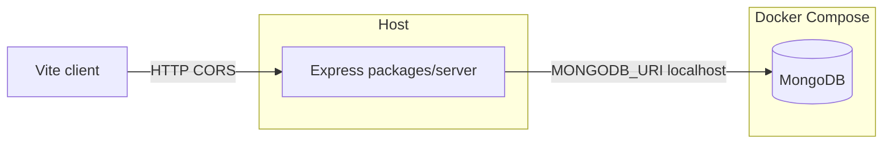

# DiMoMe v3 — backend implementation plan (BE_PLAN)

Actionable build order for **`packages/server`**, aligned with [BACKEND_REQUIREMENTS.md](./BACKEND_REQUIREMENTS.md). Update this file as milestones complete.

## Checklist

- [ ] **A — Compose & env:** `docker-compose.yml` (Mongo, volume, healthcheck), `.env.example`, root `package.json` scripts for `-w server`
- [ ] **B — Server skeleton:** Express, TS, MongoClient, `GET /api/v1/health`, CORS, graceful shutdown
- [ ] **C — Layout:** `ports/`, `adapters/persistence/mongo/`, routes, JSON error envelope
- [ ] **D — Public menu:** `PublicMenuReadPort`, `GET /api/v1/public/menus/:menuId` → `PublicMenuData` shape, `db:seed` (incl. `menu-1`)
- [ ] **E — Auth + owner reads:** `POST /api/v1/auth/login`, JWT middleware, `GET /api/v1/owner/menus` (etc.)
- [ ] **F — Owner CRUD:** menus / categories / items behind ports; document in `packages/server/README.md`
- [ ] **Later:** R2, CSV/AI jobs + polling, optional `packages/types`, SSE/Redis, RabbitMQ ([BACKEND_REQUIREMENTS.md §7](./BACKEND_REQUIREMENTS.md))

---

## Context

- Workspace today: [package.json](./package.json) only runs **client**; no `packages/server` yet.
- Stack: [BACKEND_REQUIREMENTS.md](./BACKEND_REQUIREMENTS.md) — Express, **`/api/v1/`**, native **`mongodb`**, ports/adapters, **Docker Compose for Mongo**, **API on host**.
- First vertical slice ([BACKEND_REQUIREMENTS.md §9](./BACKEND_REQUIREMENTS.md)): health, Mongo, minimal auth, persistence, **public read menu** — replaces client [`readPublicMenu`](./packages/client/src/mocks/mockApi.ts) when wired; payload shape [`PublicMenuData`](./packages/client/src/types/index.ts).

---

## Phase A — Local Mongo + workspace wiring

1. Add [docker-compose.yml](./docker-compose.yml): **single `mongo` service**, port **27017**, **named volume**, **healthcheck** (BACKEND §3).
2. Add [.env.example](./.env.example): `MONGODB_URI=mongodb://localhost:27017/dimome`; placeholders for `JWT_SECRET`, `PORT`.
3. Extend root [package.json](./package.json): `dev:server`, `build:server`, `lint:server` with `-w server`.

---

## Phase B — `packages/server` package skeleton

1. **`packages/server`**: `package.json` (`name: server`, Node 24 `engines`), deps **`express`**, **`mongodb`**, **`dotenv`**; dev **`typescript`**, **`tsx`**, **`@types/express`**, **`@types/node`**.
2. **`tsconfig.json`** for Node; align **`"type"`** with ESM vs CJS choice.
3. Entry: **`dotenv/config`**, **`MongoClient`**, connect once, **`getDb()`** or `app.locals`; **graceful shutdown** on SIGINT.
4. **`GET /api/v1/health`** — `{ ok: true }`, optional DB ping.
5. **CORS** for `http://localhost:5173` + env-driven origins.

---

## Phase C — Folder structure and error envelope

- `src/ports/` — interfaces only (`PublicMenuReadPort`, …).
- `src/adapters/persistence/mongo/` — native driver + mappers; **string IDs** at port boundary.
- `src/routes/` (or `src/http/`) — thin Express routers.
- `src/domain/` (optional) — plain types.

**Errors:** consistent JSON e.g. `{ error: { code, message } }` + HTTP status mapping (BACKEND §6).

---

## Phase D — First persistence + public API

1. **Collections / shapes:** minimal schema; must serialize to **`PublicMenuData`** (`menuId`, `venueName`, `categories[]`, `itemsById`). Document choice in `packages/server/README.md`.
2. **`PublicMenuReadPort`** + Mongo adapter: `getPublishedMenuByPublicId(menuId)`.
3. **`GET /api/v1/public/menus/:menuId`** — no JWT; **404** if unknown/unpublished.
4. **`db:seed`** script: data aligned with [fixtures.ts](./packages/client/src/mocks/fixtures.ts) so **`menu-1`** works for manual testing.

---

## Phase E — Minimal auth + first protected owner endpoints

1. **`POST /api/v1/auth/login`:** seeded user + **`bcrypt`** + short-lived **JWT** (`sub`, optional `venueId`). Document **`JWT_SECRET`** / expiry in `.env.example`.
2. **Auth middleware** for **`/api/v1/owner/*`**.
3. **Owner reads first:** e.g. **`GET /api/v1/owner/menus`** → [`OwnerMenuSummary[]`](./packages/client/src/types/index.ts).

Then **CRUD** for menus / categories / items per [REQUIREMENTS.md](./REQUIREMENTS.md) §4–5; keep handlers thin.

---

## Phase F — Later (separate milestones)

- **R2** presigned uploads (BACKEND §6).
- **CSV / AI jobs:** job docs in Mongo, worker, **`GET .../jobs/:id`** polling (BACKEND §7.2).
- **`packages/types`** when DTO duplication hurts.
- **SSE + Redis** (§7.3), **RabbitMQ** (§7.4) after polling is stable.

---

## Docs after implementation

- [packages/server/README.md](./packages/server/README.md) — run, Compose, seed, env.
- [STATUS.md](./STATUS.md) — mark server + Compose done when shipped.

---

## Client integration (follow-up)

Replace mock `readPublicMenu` with **`fetch`** to the public menu API: Vite proxy or **`VITE_API_URL`**, Suspense-friendly loading, Bearer token for owner. Can validate Phase D with **curl** first.

---

*See [BACKEND_REQUIREMENTS.md](./BACKEND_REQUIREMENTS.md) for stack decisions and async-job phases.*
