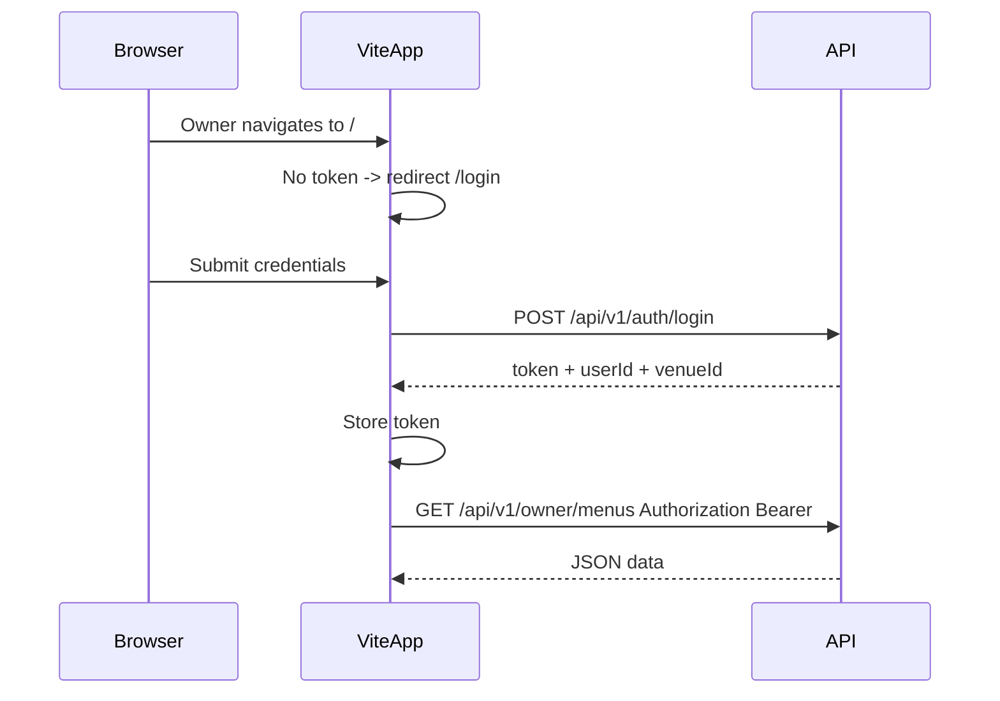

# 2026-04-08 — Client–backend integration

## Goals for today

1. **Single source of truth** for “which route powers which screen,” maintained for frontend developers.
2. **Start real wiring**: base URL, JSON/`fetch` layer, login + JWT, then replace mocks in a safe order (guest first, then owner reads).

---

## Part A — Documentation (dated mapping)

**Add a new file** such as [`dimome3/CLIENT_API_MAP_2026-04-08.md`](dimome3/CLIENT_API_MAP_2026-04-08.md) (dated filename as requested; include a one-line “Last updated” at top for future edits).

**Contents to include:**

- **Base path:** all API routes under `/api/v1/` (see [`packages/server/src/createApp.ts`](dimome3/packages/server/src/createApp.ts)).
- **Auth:** `POST /api/v1/auth/login` body `{ email, password }` → `{ token, userId, venueId }`; owner routes require `Authorization: Bearer <token>` ([`packages/server/src/routes/v1/auth.ts`](dimome3/packages/server/src/routes/v1/auth.ts), [`packages/server/README.md`](dimome3/packages/server/README.md)).
- **Error shape:** `{ error: { code, message } }` + HTTP status ([`packages/server/src/http/errors.ts`](dimome3/packages/server/src/http/errors.ts)).
- **Route table** with columns: HTTP method, path, auth, response shape (reference client types in [`packages/client/src/types/index.ts`](dimome3/packages/client/src/types/index.ts) where they align with server DTOs in [`packages/server/src/domain/menu.ts`](dimome3/packages/server/src/domain/menu.ts)).

**UI ↔ API matrix** (route → page/component; page → which call today in [`packages/client/src/mocks/mockApi.ts`](dimome3/packages/client/src/mocks/mockApi.ts)):

| Client route / area                         | Mock function             | API (when wired)                                                                                  | Notes                                                                                                                                                                                                                                                                                                               |
| ------------------------------------------- | ------------------------- | ------------------------------------------------------------------------------------------------- | ------------------------------------------------------------------------------------------------------------------------------------------------------------------------------------------------------------------------------------------------------------------------------------------------------------------- |
| `/qr/:menuId`, `/menu/:menuId` (guest menu) | `readPublicMenu`          | `GET /api/v1/public/menus/:menuId`                                                                | No JWT; must be **published** menu or 404 ([`publicMenu.ts`](dimome3/packages/server/src/routes/v1/publicMenu.ts), [`mongoPublicMenuReadAdapter.ts`](dimome3/packages/server/src/adapters/persistence/mongo/mongoPublicMenuReadAdapter.ts)).                                                                        |
| `…/filters`, `…/order`                      | (no menu fetch)           | —                                                                                                 | Filters use context only; order stub.                                                                                                                                                                                                                                                                               |
| `/` overview, `/menus`                      | `readOwnerMenus`          | `GET /api/v1/owner/menus`                                                                         | JWT                                                                                                                                                                                                                                                                                                                 |
| `/menus/:menuId`                            | `readOwnerMenuCategories` | `GET /api/v1/owner/menus/:menuId/categories` **+** `GET /api/v1/owner/menus` (or cached menu row) | API returns **only** `CategorySummaryDto[]` for categories; client type [`OwnerMenuCategoriesData`](dimome3/packages/client/src/types/index.ts) also needs `menuName` and `venueName` — **compose** from menus list + `GET /owner/categories` for `venueName`, or document one extra field in a future API version. |
| `/categories`                               | `readOwnerCategories`     | `GET /api/v1/owner/categories`                                                                    | Returns `{ venueName, categories }` — matches `OwnerCategoriesData`.                                                                                                                                                                                                                                                |
| `/menus/:menuId/category/:categoryId`       | `readOwnerCategoryPage`   | **Gap — see below**                                                                               | Mock builds rows from **full** public menu. Public API only includes items with `visibleOnMenu: true` ([`mongoPublicMenuReadAdapter.ts`](dimome3/packages/server/src/adapters/persistence/mongo/mongoPublicMenuReadAdapter.ts) L23–26), so it is **not** sufficient for a true owner category table.                |
| `/items/:itemId/edit`                       | `readItemEditor`          | `GET /api/v1/owner/menus/:menuId/items/:itemId`                                                   | JWT; **requires `menuId` in URL** — today editor uses global `itemId` only; router/layout may need `menuId` in path or location state (see [`ItemEditPage.tsx`](dimome3/packages/client/src/pages/owner/ItemEditPage.tsx), [`router.tsx`](dimome3/packages/client/src/router.tsx)).                                 |
| `/items/new`                                | local empty state         | `POST /api/v1/owner/menus/:menuId/items`                                                          | Not in mock API; wire when doing mutations.                                                                                                                                                                                                                                                                         |
| CSV steps 1–3                               | `readCsvPreview`          | —                                                                                                 | **No backend** yet ([`BACKEND_REQUIREMENTS.md`](dimome3/BACKEND_REQUIREMENTS.md) §7).                                                                                                                                                                                                                               |
| Scan steps 1–3                              | `readScanDraft`           | —                                                                                                 | Same.                                                                                                                                                                                                                                                                                                               |

**Document the owner category gap explicitly** in the mapping file with two options:

- **MVP:** temporarily use `GET /api/v1/public/menus/:menuId` for the category table and accept that **hidden items are omitted**.
- **Recommended for real owner UX:** add something like `GET /api/v1/owner/menus/:menuId/items?categoryPublicId=…` (or include `itemIds` on owner category summaries) implemented in [`owner.ts`](dimome3/packages/server/src/routes/v1/owner.ts) + [`OwnerItemsPort`](dimome3/packages/server/src/ports/ownerItemsPort.ts) + [`mongoOwnerItemsAdapter.ts`](dimome3/packages/server/src/adapters/persistence/mongo/mongoOwnerItemsAdapter.ts).

**Cross-links:** point to [`packages/server/README.md`](dimome3/packages/server/README.md) for the summary table; keep the new file as the **page-level** index.

---

## Part B — Client plumbing (foundation)

- **Environment:** `VITE_API_URL` (e.g. `http://localhost:3000`) in [`packages/client`](dimome3/packages/client) `.env.example` / docs; build URLs as ``${import.meta.env.VITE_API_URL}/api/v1/...``.
- **Alternative:** Vite [`vite.config.ts`](dimome3/packages/client/vite.config.ts) `server.proxy` for `/api` → `http://localhost:3000` so the app can call `/api/v1/...` same-origin (CORS already allows `5173` via [`packages/server/src/config.ts`](dimome3/packages/server/src/config.ts) — proxy is optional).
- **Shared helper:** e.g. `packages/client/src/api/client.ts` — `apiJson(path, { method, body, token? })` that throws a small `ApiError` with `code`/`message` from the envelope.
- **Optional:** keep [`mockApi.ts`](dimome3/packages/client/src/mocks/mockApi.ts) behind a flag (`VITE_USE_MOCK_API=true`) for quick fallback during development.

---

## Part C — Authentication

- **Login screen** (new route, e.g. `/login`) posting to `POST /api/v1/auth/login`.
- **Token storage:** `sessionStorage` or `localStorage` + **React context** providing `token`, `login`, `logout`, and `fetchWithAuth`.
- **Protect owner routes:** wrap [`OwnerLayout`](dimome3/packages/client/src/layouts/OwnerLayout.tsx) or a layout child so unauthenticated users redirect to `/login` (guest `/qr/*` and `/menu/*` stay public).
- **Seed credentials** in the mapping doc: `dev@dimome.local` / `password` ([`packages/server/README.md`](dimome3/packages/server/README.md)).

---

## Part D — Replace mocks (incremental)

Suggested order (each step testable with dev server + seeded DB):

1. **Guest:** implement real `readPublicMenu` via `GET /api/v1/public/menus/:menuId` ([`GuestMenuPage.tsx`](dimome3/packages/client/src/pages/guest/GuestMenuPage.tsx)).
2. **Owner lists:** `readOwnerMenus`, `readOwnerCategories`, `readOwnerMenuCategories` (with composition for `menuName` / `venueName` as documented).
3. **Owner category page:** either MVP public-menu fetch or new owner **list items** endpoint (per Part A).
4. **Item editor:** `GET` by menu + item id; adjust routing if needed so `menuId` is always known.
5. **Mutations** (can spill past “today”): `PATCH` item, `POST` new item, menu/category create/patch — update caches or drop `cachedPromise` for affected keys.

**CSV / AI:** leave on mocks; mapping doc already marks as N/A.

---

## Part E — Light doc touchpoints

- Add a short “**Using the real API**” subsection to [`packages/client/README.md`](dimome3/packages/client/README.md) linking to `CLIENT_API_MAP_2026-04-08.md`.
- Optionally one line in [`dimome3/STATUS.md`](dimome3/STATUS.md) under client: mocks vs API flag / login.

---

## Suggested scope boundary for “today”

| In scope                                       | Out of scope (unless time remains)                    |
| ---------------------------------------------- | ----------------------------------------------------- |
| Dated `CLIENT_API_MAP_2026-04-08.md`           | Full mutation coverage (save new item, archive, etc.) |
| `fetch` + env + optional proxy                 | R2, CSV/AI jobs                                       |
| Login + JWT + protected owner shell            | Refresh tokens                                        |
| Guest `readPublicMenu` + 1–2 owner reads wired | Entire app in one PR                                  |

If **owner category page** must show hidden items on day one, schedule the **small owner list-items route** in the same batch as the category page wiring (document in the map first, then implement server + client together).