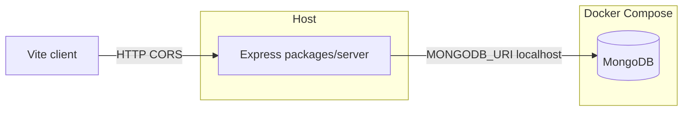

# DiMoMe v3 — backend implementation plan (BE_PLAN)

Actionable build order for **`packages/server`**, aligned with [BACKEND_REQUIREMENTS.md](./BACKEND_REQUIREMENTS.md). Update this file as milestones complete.

## Checklist

- [x] **A — Compose & env:** `docker-compose.yml` (Mongo, volume, healthcheck), `.env.example`, root `package.json` scripts for `-w server`
- [x] **B — Server skeleton:** Express, TS, MongoClient, `GET /api/v1/health`, CORS, graceful shutdown
- [x] **C — Layout:** `ports/`, `adapters/persistence/mongo/`, routes, JSON error envelope
- [x] **D — Public menu:** `PublicMenuReadPort`, `GET /api/v1/public/menus/:menuId` → `PublicMenuData` shape, `db:seed` (incl. `menu-1`)
- [x] **E — Auth + owner reads:** `POST /api/v1/auth/login`, JWT middleware, `GET /api/v1/owner/menus` (etc.)
- [x] **F — Owner CRUD:** menus / categories / items behind ports; document in `packages/server/README.md` (includes **list items** `GET .../menus/:menuId/items` for owner category views)
- [x] **G — CSV import (MVP):** [`packages/jobs`](../packages/jobs/) job store + worker loop; server **`csv-import-jobs`** routes + `csv-parse` + in-process worker; client nested **`/menus/:menuId/import/csv`** — see [CSV_IMPORT_IMPLEMENTATION.md](./CSV_IMPORT_IMPLEMENTATION.md)
- [ ] **Later:** R2, **AI scan** jobs + polling, optional `packages/types`, SSE/Redis, RabbitMQ ([BACKEND_REQUIREMENTS.md §7](./BACKEND_REQUIREMENTS.md))

---

## Context

- **`packages/server` exists** — first vertical slice (2026-04-07); see [packages/server/README.md](../packages/server/README.md). **Client** uses the **live API** by default (2026-04-08); optional **`VITE_USE_MOCK_API=true`** restores fixtures — see [CLIENT_API_MAP_2026-04-08.md](../CLIENT_API_MAP_2026-04-08.md) and [STATUS.md](./STATUS.md).
- Stack: [BACKEND_REQUIREMENTS.md](./BACKEND_REQUIREMENTS.md) — Express, **`/api/v1/`**, native **`mongodb`**, ports/adapters, **Docker Compose for Mongo**, **API on host**.
- **Owner items list (2026-04-08):** `GET /api/v1/owner/menus/:menuId/items` with optional **`categoryPublicId`** supports the owner category table (including non–guest-visible items).

---

## Phase A — Local Mongo + workspace wiring

1. Add [docker-compose.yml](../docker-compose.yml): **single `mongo` service**, port **27017**, **named volume**, **healthcheck** (BACKEND §3).
2. Add [.env.example](../.env.example): `MONGODB_URI=mongodb://localhost:27017/dimome`; placeholders for `JWT_SECRET`, `PORT`.
3. Extend root [package.json](../package.json): `dev:server`, `build:server`, `lint:server` with `-w server`.

---

## Phase B — `packages/server` package skeleton

1. **`packages/server`**: `package.json` (`name: server`, Node 24 `engines`), deps **`express`**, **`mongodb`**, **`dotenv`**; dev **`typescript`**, **`tsx`**, **`@types/express`**, **`@types/node`**.
2. **`tsconfig.json`** for Node; align **`"type"`** with ESM vs CJS choice.
3. Entry: **`dotenv/config`**, **`MongoClient`**, connect once, **`getDb()`** or `app.locals`; **graceful shutdown** on SIGINT.
4. **`GET /api/v1/health`** — `{ ok: true }`, optional DB ping.
5. **CORS** for `http://localhost:5173` + env-driven origins.

---

## Phase C — Folder structure and error envelope

- `src/ports/` — interfaces only (`PublicMenuReadPort`, …).
- `src/adapters/persistence/mongo/` — native driver + mappers; **string IDs** at port boundary.
- `src/routes/` (or `src/http/`) — thin Express routers.
- `src/domain/` (optional) — plain types.

**Errors:** consistent JSON e.g. `{ error: { code, message } }` + HTTP status mapping (BACKEND §6).

---

## Phase D — First persistence + public API

1. **Collections / shapes:** minimal schema; must serialize to **`PublicMenuData`** (`menuId`, `venueName`, `categories[]`, `itemsById`). Document choice in `packages/server/README.md`.
2. **`PublicMenuReadPort`** + Mongo adapter: `getPublishedMenuByPublicId(menuId)`.
3. **`GET /api/v1/public/menus/:menuId`** — no JWT; **404** if unknown/unpublished.
4. **`db:seed`** script: data aligned with [fixtures.ts](../packages/client/src/mocks/fixtures.ts) so **`menu-1`** works for manual testing.

---

## Phase E — Minimal auth + first protected owner endpoints

1. **`POST /api/v1/auth/login`:** seeded user + **`bcrypt`** + short-lived **JWT** (`sub`, optional `venueId`). Document **`JWT_SECRET`** / expiry in `.env.example`.
2. **Auth middleware** for **`/api/v1/owner/*`**.
3. **Owner reads first:** e.g. **`GET /api/v1/owner/menus`** → [`OwnerMenuSummary[]`](../packages/client/src/types/index.ts).

Then **CRUD** for menus / categories / items per [REQUIREMENTS.md](./REQUIREMENTS.md) §4–5; keep handlers thin.

---

## Phase F — Later (separate milestones)

- **R2** presigned uploads (BACKEND §6).
- **CSV / AI jobs:** job docs in Mongo, worker, **`GET .../jobs/:id`** polling (BACKEND §7.2).
- **`packages/types`** when DTO duplication hurts.
- **SSE + Redis** (§7.3), **RabbitMQ** (§7.4) after polling is stable.

---

## Docs after implementation

- [x] [packages/server/README.md](../packages/server/README.md) — run, Compose, seed, env, route table, **API + Vite client together**.
- [x] [STATUS.md](./STATUS.md) — server + Compose + changelog updated.

---

## Client integration

**Shipped (2026-04-08):** Vite **`/api` proxy** (or **`VITE_API_URL`**), **`apiJson`** + Bearer token for owner routes, **`/login`**, **`mockApi`** branching on **`VITE_USE_MOCK_API`**, guest + owner reads, item editor path with **`menuId`**. Reference: [CLIENT_API_MAP_2026-04-08.md](../CLIENT_API_MAP_2026-04-08.md), [packages/client/README.md](../packages/client/README.md).

**Next:** wire **mutations** (PATCH item, POST new item, …) and invalidate read caches as needed.

---

*Checklist updated 2026-04-08. See [BACKEND_REQUIREMENTS.md](./BACKEND_REQUIREMENTS.md) for stack decisions and async-job phases.*
